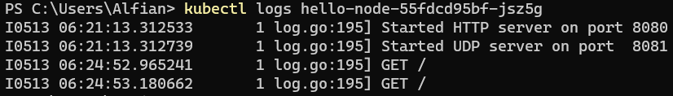

## Hello Minikube Reflections

1. Compare the application logs before and after you exposed it as a Service. Try to open the app several times while the proxy into the Service is running. What do you see in the logs? Does the number of logs increase each time you open the app? 

* Before:

* After:


Each time the application is accessed, it generates a log entry `GET /` for the incoming request, which is captured in the logs of the corresponding Pod.

2. Notice that there are two versions of `kubectl get` invocation during this tutorial section. The first does not have any option, while the latter has `-n` option with value set to `kube-system`. What is the purpose of the `-n` option and why did the output not list the pods/services that you explicitly created? 

The `-n` or `--namespace` option in kubectl is used to specify the Kubernetes namespace in which to perform operations. When not specifying a namespace, kubectl defaults to the default namespace. Running `kubectl get -n kube-system` lists resources in the kube-system namespace, which contains system components rather than user-created resources.

##  Rolling Update & Kubernetes Manifest File Reflections

1. What is the difference between Rolling Update and Recreate deployment strategy?

A Rolling Update gradually replaces old pods with new ones, ensuring some are always running. Meanwhile, a Recreate deployment stops all old pods before starting new ones, causing downtime.

2. Try deploying the Spring Petclinic REST using Recreate deployment strategy and document your attempt.

What I did is basically changing strategy inside the deployment.yaml file into this:
```yaml
spec:
  strategy:
    type: Recreate
```
and then apply it to kubectl.

3. Prepare different manifest files for executing Recreate deployment strategy.
[deployment file](recreate_deployment.yaml)
[service file](recreate_service.yaml)

4. What do you think are the benefits of using Kubernetes manifest files? Recall your experience in deploying the app manually and compare it to your experience when deploying the same app by applying the manifest files (i.e., invoking `kubectl apply -f` command) to the cluster.

I can easily recreate a deployment without needing to set up the configuration files again.